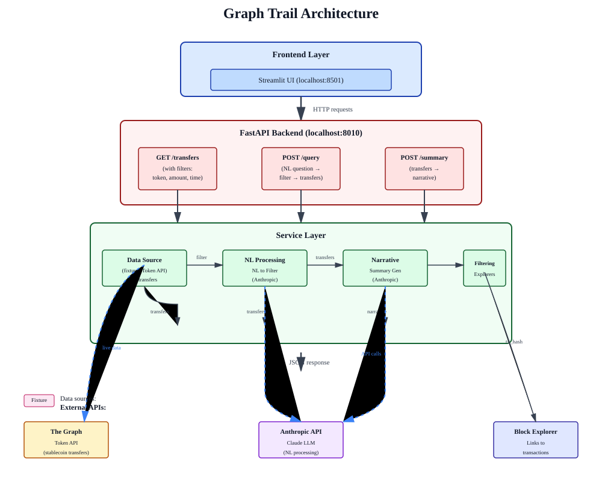

# Graph Trail Architecture

A ledger of large stablecoin transfers where every number traces back to its onchain source.

## System Overview



## Components

### Frontend Layer
- **Streamlit UI** (localhost:8501) — Interactive interface for browsing and querying transfers
  - Communicates exclusively via HTTP to the backend
  - Never imports backend code or touches data sources directly
  - Two panels: "Or browse directly" (no API key needed) and NL question bar (requires `ANTHROPIC_API_KEY`)

### Backend Layer (FastAPI)
Runs on localhost:8010 with three main endpoints:

#### GET `/transfers`
Retrieves stablecoin transfers with optional filters:
- `token` — filter by token (USDC, USDT, PYUSD)
- `chain` — filter by blockchain
- `min_amount_usd` — minimum transaction amount
- `since` / `until` — time range

#### POST `/query`
Natural language query endpoint:
1. Takes a question like "USDC transfers over $1M in the last week"
2. Converts NL to filter via Anthropic Claude
3. Fetches filtered transfers
4. Returns transfers + metadata

#### POST `/summary`
Generates narrative summaries:
1. Takes a set of transfers
2. Generates a short narrative via Anthropic Claude
3. Returns human-readable summary

### Service Layer

#### Data Source
Abstracts where transfer data comes from — configurable via `DATA_SOURCE` env var:
- `fixture` (default) — Real on-chain transactions from `data/fixtures/sample_transfers.json`
  - Fetched from live Ethereum block range via public RPC
  - Every `tx_hash` is genuine and verifiable on-chain
  - Regenerate with `python scripts/regenerate_fixture_data.py`
- `token_api` — Live ERC-20 stablecoin transfers from The Graph's Token API
  - Requires `TOKEN_API_KEY` from https://api.pinax.network
  - Real-time data for USDC/USDT/PYUSD on Ethereum

#### NL Processing
- **NL to Filter** — Converts natural language questions to structured filters
- Uses Anthropic Claude API (requires `ANTHROPIC_API_KEY`)
- Powers the `/query` endpoint

#### Narrative Generation
- **Summary Generator** — Creates human-readable narratives from transfer data
- Uses Anthropic Claude API
- Powers the `/summary` endpoint

#### Filtering & Explorers
- **Filtering** — Applies token, amount, and time-based filters to transfers
- **Explorer URLs** — Builds block explorer links (Etherscan, etc.) from transaction hashes
  - Every transfer links back to its canonical on-chain source

### External Integrations

#### The Graph Token API
- Source of live stablecoin transfer data (when `DATA_SOURCE=token_api`)
- Tracks USDC, USDT, PYUSD transfers on Ethereum
- Sign up at https://api.pinax.network

#### Anthropic Claude API
- Powers NL-to-filter conversion in `/query`
- Powers narrative generation in `/summary`
- Requires `ANTHROPIC_API_KEY` in `.env`

#### Block Explorers
- Links every transfer back to its transaction on Etherscan or other explorers
- `tx_hash` → explorer URL ensures traceability

## Data Flow

1. **Direct browse** — Frontend calls GET `/transfers` with optional filters → returns transfer data
2. **NL query** — Frontend calls POST `/query` with question → Claude converts to filter → returns transfers
3. **Summary** — Frontend calls POST `/summary` with transfers → Claude generates narrative

All responses include:
- Timestamp, token, amount (USD), addresses
- Chain, data source, and **explorer URL** (traceable to on-chain source)

## Configuration

Create a `.env` file in the project root:

```bash
# Data source selection
DATA_SOURCE=fixture  # or 'token_api'

# If using token_api
TOKEN_API_KEY=<your-key-from-pinax.network>

# For NL query and summary features
ANTHROPIC_API_KEY=<your-anthropic-api-key>

# Frontend backend URL (default shown)
BACKEND_URL=http://127.0.0.1:8010
```

See [docs/anthropic-api-key.md](./anthropic-api-key.md) for Anthropic API key setup.

## Development

```bash
# Install dependencies
python -m venv .venv && source .venv/bin/activate
pip install -r requirements.txt

# Start backend
uvicorn backend.main:app --reload --port 8010

# In another terminal, start frontend
source .venv/bin/activate
streamlit run frontend/app.py

# Run tests
pytest                      # no API keys needed
pytest -m integration       # requires ANTHROPIC_API_KEY
```

See [README.md](../README.md) for full setup instructions.
